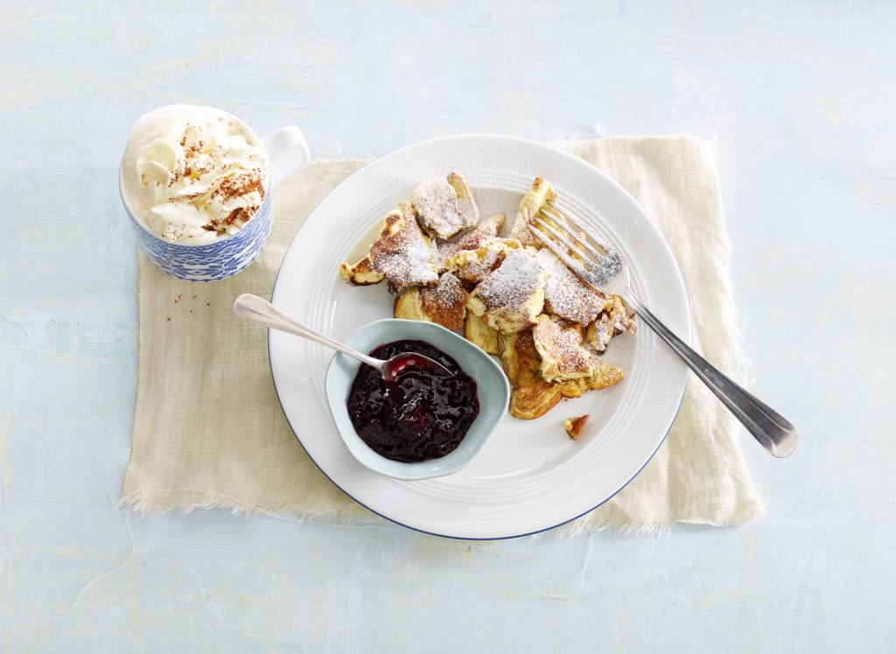

# skillles6

## Kaiserschmarrn

**Heerlijke, luchtige variatie op de Hollandse pannenkoek.**

360 kcal(voedingswaarden)
25 min. bereiden
4 personen

**Ingredienten**

- 4 middelgrote eieren
- 50 g kristalsuiker
- 100 g tarwebloem
- 100 ml volle melk
- 40 g ongezouten roomboter
- 2 g poedersuiker
- 100 g kersenjam in pot

---

**Bereidingswijze**

1. Splits de eieren. Klop de eidooiers en suiker met een mixer in een kom licht en romig. Bewaar de eiwitten. Zeef de bloem erboven en klop met de melk tot een glad beslag. Klop de eiwitten in een vetvrije kom stijf en spatel in delen door het beslag.

2. Verhit de boter in 2 koekenpannen op laag vuur en verdeel het beslag over de pannen. Bak 3 min. Snijd de pannenkoeken in vieren en keer de kwarten om met behulp van een spatel. Verdeel nu met de spatel de kwarten in kleinere stukjes. Bak nog 3 min. en keer regelmatig.

3. Bestuif de kaiserschmarrn met de poedersuiker en serveer met de jam.